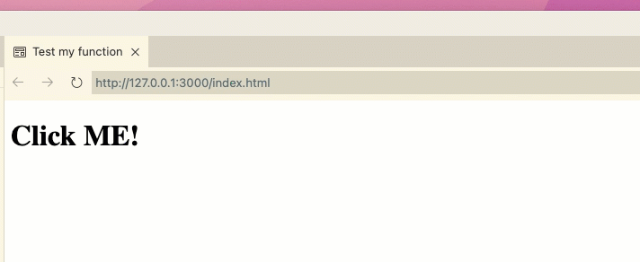

# JavaScript to TypeScript Tutorial for Junior Developers
This repository is hosting a project page that will be a tutorial on how to convert JavaScript to TypeScript for beginners at TypeScript.
## Week One: JavaScript Fundamentals turned TypeScript
- [ ] Tutorial Stuff
  - [ ] Types Page
    - [x] Inferred Types
    - [x] Defined Types
    - [x] Composing Types
    - [x] Structural Types
    - [ ] Images
  - [ ] Basics Page
    - [ ] Static Type Checking
    - [ ] Non-Exception Failures
    - [ ] Types for Tooling
    - [ ] TypeScript Compiler
    - [ ] Emitting with Errors
    - [ ] Explicit Types
    - [ ] Erased Types
    - [ ] Downleveling
    - [ ] Strictness
  - [ ] From Page
    - [ ] General Outline
    - [ ] Images
  - [ ] With Page
    - [ ] General Outline
    - [ ] Images
  - [ ] More Page
    - [ ] General Outline
    - [ ] Images
- [ ] CSS File
  - [x] General Formatting
  - [ ] Famcy Stuff :)
 
# OTHER README CONTENT

# Typescript Hello world

This is a hello world showing typescript in the browser and jest unit testing.

## Build

To build the project run `npm run compile`. The results will be in the build
directory.

```
$ npm run compile

> hello_world@1.0.0 compile
> tsc

$ ls build
__tests__  app.js     app.js.map
```

## Test

This sample is setup to use the jest testing framework. Run `npm test` to run
the tests.

```
$npm test
> hello_world@1.0.0 test
> npm run compile && npm run unit


> hello_world@1.0.0 compile
> tsc


> hello_world@1.0.0 unit
> jest

 PASS  __tests__/test.app.ts
  sum module
    ✓ returns the string hello (1 ms)

Test Suites: 1 passed, 1 total
Tests:       1 passed, 1 total
Snapshots:   0 total
Time:        0.724 s, estimated 1 s
Ran all test suites.
shane|(master *%=):typescript-hello$ npm test

> hello_world@1.0.0 test
> npm run compile && npm run unit


> hello_world@1.0.0 compile
> tsc


> hello_world@1.0.0 unit
> jest

 PASS  __tests__/test.app.ts
  sum module
    ✓ returns the string hello (2 ms)

Test Suites: 1 passed, 1 total
Tests:       1 passed, 1 total
Snapshots:   0 total
Time:        0.389 s, estimated 1 s
Ran all test suites.
```

## HTML

There is an example index.html that shows you how to import the the compiled
file as an ES6 module and attached it to the onclick event. After you have built
the project. Open up the index.html using live preview to see the results!


